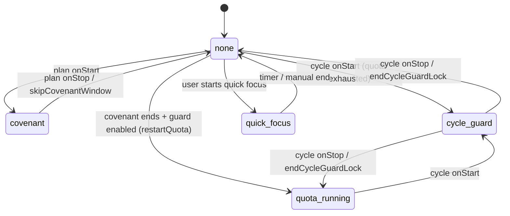

# 活跃锁定态（Active Lock State）

> 版本：v1  
> 状态：已实现  
> 目标：为首页「锁定中」UI 提供单一事实来源，契约、循环守护、快速专注统一读写。

---

## 背景

系统 ScreenTimeGuard 在策略生效/停止时会回调 `TimeGuardExtAbility.onStart` / `onStop`：

- **契约**：策略名 `plan_*`，由 `TimeGuardRuntimeService` 处理
- **循环守护**：策略名 `cycle_quota_strategy`，由 `CycleGuardService` 处理

**快速专注**不走策略回调，直接调用 `setAppsRestriction` / `releaseAppsRestriction`。

当前实现将锁定信息分散在 `FocusSession`（契约 + 快速专注）与 `CycleGuardState.phase`（守护）中，首页需拼装多套条件。本文档定义统一替代方案。

---

## 设计原则

1. **单一数据源**：运行时锁定态只存一份 `ActiveLockState`
2. **必须持久化**：写入 Preferences 并 `flushSync`，杀进程重进可恢复
3. **展示优先级**：`covenant` > `cycle_guard` > `quick_focus` > `none`（产品约束：三者不会同时在 OS 层生效）
4. **架构优先**：移除 `FocusSession` / `FocusStore` / `FocusPersistenceService`，不做兼容层
5. **暂不校准**：冷启动只信本地持久化，不与系统策略状态对账（后续可扩展）

---

## 数据结构

### LockKind

```typescript
type LockKind = 'none' | 'covenant' | 'cycle_guard' | 'quick_focus';
```

| 值 | 含义 | 写入方 |
|----|------|--------|
| `none` | 未锁定 | 各结束路径 |
| `covenant` | 契约窗口锁定 | `TimeGuardExtAbility` → `handlePlanStrategyStart` |
| `cycle_guard` | 循环守护额度耗尽锁定 | `TimeGuardExtAbility` → `handleCycleStrategyStart` |
| `quick_focus` | 快速专注 | `QuickStartPage` 开始专注 |

### ActiveLockState

```typescript
interface ActiveLockState {
  kind: LockKind;

  /** 关联策略名：plan_xxx | cycle_quota_strategy | '' */
  strategyName: string;

  /** UI 标题：契约名 | 循环守护 | 快速专注 */
  title: string;

  /** 契约 ID，仅 kind=covenant 时有值 */
  planId: string;

  selectedTokens: string[];
  selectedCount: number;
  mode: 'shield' | 'allow';

  /** 锁定开始时间（ms） */
  startedAt: number;

  /**
   * 预计结束时间（ms）。
   * - covenant / quick_focus：有明确结束时刻
   * - cycle_guard：0（手动结束前无固定结束）
   */
  endAt: number;

  /** 最后一次写入时间（ms），排障用 */
  updatedAt: number;
}
```

### 默认值

```typescript
function createIdleLockState(): ActiveLockState {
  return {
    kind: 'none',
    strategyName: '',
    title: '',
    planId: '',
    selectedTokens: [],
    selectedCount: 0,
    mode: 'shield',
    startedAt: 0,
    endAt: 0,
    updatedAt: Date.now()
  };
}
```

### 持久化

| 项 | 值 |
|----|-----|
| Store 名称 | `focus_vow_store` |
| Context | **应用级** `ApplicationContext`（`getApplicationContext()`） |
| 磁盘路径 | `/data/storage/el2/base/preferences/` |
| 锁态 Key | `active.lock.state` |
| 格式 | `JSON.stringify(ActiveLockState)` |

主应用与 `TimeGuardExtAbility` 扩展进程共用上述路径；扩展写入后须 `flushSync`，主进程读前清 Preferences 缓存（见 `PreferencesService`）。

### AppStorage

| Key | 类型 |
|-----|------|
| `lock.activeState` | `ActiveLockState` |

由 `LockStore` 统一 `hydrate` / `set` / `clear`。

---

## 与 CycleGuardState 的关系

`CycleGuardState` **保留**，但只承载循环守护的**配置与运行阶段**，不再单独表达「是否在锁」：

```typescript
interface CycleGuardState {
  enabled: boolean;
  quotaMinutes: number;
  selectedTokens: string[];
  selectedAppCount: number;
  phase: 'idle' | 'quota_running' | 'locked';
  statusMessage: string;
}
```

| 场景 | ActiveLockState | CycleGuardState.phase |
|------|-----------------|----------------------|
| 守护未启动 | `none` | `idle` |
| 共享额度计时中 | `none` | `quota_running` |
| 额度耗尽、系统锁定 | `cycle_guard` | `locked` |

写入时两处同步更新，读取首页锁定 UI **只读 `ActiveLockState`**。

---

## 写入规则

### 契约 `onStart`

触发：`TimeGuardExtAbility.onStart`，`strategyName` 为 `plan_*`

1. 查计划，校验 `enabled` 且 `selectedTokens.length > 0`
2. 计算当前窗口 `startAt` / `endAt`（沿用 `getPlanWindow`）
3. 写入：

```typescript
{
  kind: 'covenant',
  strategyName: plan.id,
  title: plan.name,
  planId: plan.id,
  selectedTokens: plan.selectedTokens,
  selectedCount: plan.selectedTokens.length,
  mode: plan.mode,
  startedAt: window.startAt,
  endAt: window.endAt,
  updatedAt: Date.now()
}
```

### 契约 `onStop`

触发：`TimeGuardExtAbility.onStop`，`strategyName` 为 `plan_*`

1. 若当前 `kind === 'covenant'` 且 `planId === strategyName`，清空为 `none`
2. 若循环守护 `enabled`，调用 `restartQuotaStrategy`（**重新开始共享额度计时**，见下文）

### 循环守护 `onStart`（进入锁定）

触发：额度耗尽，扩展回调 `onStart(cycle_quota_strategy)`

前置：`CycleGuardState.enabled && phase === 'quota_running'`

1. `CycleGuardState.phase` → `locked`
2. `ActiveLockState` → `kind: 'cycle_guard'`，`strategyName: 'cycle_quota_strategy'`，`title: '循环守护'`，`endAt: 0`

### 循环守护 `onStop`（离开锁定）

触发：扩展回调 `onStop(cycle_quota_strategy)`

1. `CycleGuardState.phase` → `quota_running`
2. `ActiveLockState` → `none`（若 `kind === 'cycle_guard'`）

### 快速专注开始

1. `applyScreenRestriction` 成功后写入 `kind: 'quick_focus'`
2. `startedAt = now`，`endAt = now + durationMinutes * 60_000`
3. `title = '快速专注'`，`strategyName = ''`

### 快速专注结束（手动 / 倒计时）

1. `releaseAppsRestriction`
2. `ActiveLockState` → `none`

---

## 读取与 UI（FocusHomePage）

### 判定

```typescript
function isLocked(state: ActiveLockState): boolean {
  return state.kind !== 'none';
}

function getDisplayLock(state: ActiveLockState): ActiveLockState {
  return state; // 单一源，无需合并
}
```

### 三态 UI

| 条件 | 展示 |
|------|------|
| `kind !== 'none'` | 锁定中（倒计时或锁定文案 + 结束按钮） |
| 否则 | 空状态（创建契约 / 快速专注入口） |

### 锁定中 UI 按 kind 区分

| kind | 主文案 | 副文案 | 主按钮 |
|------|--------|--------|--------|
| `covenant` | 剩余时间或契约名 | 已限制 N 个应用，当前由契约锁定 | **结束本次契约** |
| `cycle_guard` | 循环守护锁定中 | 共享额度已用完，已限制 N 个应用 | **结束当前锁定** |
| `quick_focus` | 倒计时 | 已限制 N 个应用，结束后自动解除 | **结束专注** |

### 倒计时

- `covenant` / `quick_focus`：`endAt - now`
- `cycle_guard`：不显示倒计时（`endAt === 0`）

---

## 结束锁定行为

### 快速专注 `endQuickFocus`

1. `releaseAppsRestriction(selectedTokens, mode)`
2. `LockStore.clear(context)`

### 循环守护 `endCycleGuardLock`

沿用 `endCurrentCycleGuardLockAndRestart` 语义：

1. `stopGuardStrategy(cycle_quota_strategy)`
2. `CycleGuardState.phase` → `quota_running`（经 `restartQuotaStrategy`）
3. `ActiveLockState` → `none`
4. 重新 `startGuardStrategy` 开始新一轮额度

### 契约 `skipCovenantWindow`（本次窗口跳过）

产品定义：**仅跳过当前时间窗口，计划保持启用，下一周期正常执行**。

1. `stopGuardStrategy(planId)` — 停止当前窗口内的策略执行
2. `ActiveLockState` → `none`
3. **不**修改 `plan.enabled`
4. 若 `CycleGuardState.enabled` → 调用 `restartQuotaStrategy`（守护从新开始计时，不进入 `locked`）
5. 同一窗口内不再自动锁定，直至下一重复日/下一窗口由系统调度 `onStart`

> 说明：HarmonyOS 策略为 `START_END_TIME_TYPE`，`stop` 后本窗口内通常不会再次 `onStart`，符合「跳过本次」预期。下一窗口由系统或 `syncAllPlanGuardStrategies` 重新拉起。

---

## 冲突与优先级

产品确认：**契约与守护不会在 OS 层同时生效**。

| 场景 | 行为 |
|------|------|
| 契约锁定中 | 展示 `covenant`，不展示守护 |
| 用户跳过契约 | 清空锁定；若守护已启用 → 重启额度计时（`quota_running`，非 `locked`） |
| 快速专注进行中，用户尝试再开 | 拦截（已有锁定） |

扩展进程写入时直接覆盖 `ActiveLockState`，不做多锁合并。

---

## 模块职责（目标架构）

```
models/ActiveLockModel.ets       # 类型 + 工厂 + 倒计时工具
services/ActiveLockPersistenceService.ets
stores/LockStore.ets             # hydrate / set / clear / getRemainingLabel
services/ActiveLockLifecycleService.ets  # endQuickFocus / skipCovenantWindow / endCycleGuardLock
services/TimeGuardRuntimeService.ets     # onStart/onStop → LockStore
services/CycleGuardService.ets           # onStart/onStop + restart → LockStore
services/ScreenTimeService.ets           # 契约 skip 时 stopPlanGuardStrategy
```

### 删除

| 文件/符号 | 原因 |
|-----------|------|
| `models/FocusSession.ets` | 由 `ActiveLockState` 替代 |
| `stores/FocusStore.ets` | 由 `LockStore` 替代 |
| `services/FocusPersistenceService.ets` | 由 `ActiveLockPersistenceService` 替代 |
| `services/FocusLifecycleService.ets` | 合并进 `ActiveLockLifecycleService` |
| `StoreKeys.FocusCurrentSession` 等 | 换为 `lock.activeState` |
| `focus.durationMinutes` 持久化 | 保留独立 key `quickFocus.durationMinutes`（仅快速专注默认时长） |

### 保留

| 模块 | 用途 |
|------|------|
| `CycleGuardState` + `CycleGuardStore` | 守护配置 + `phase` 阶段机 |
| `PlanStore` / `FocusPlan` | 契约配置 |
| `SettingsStore` | 授权、快速专注默认应用选择 |

---

## 扩展进程注意事项

`TimeGuardExtAbility` 运行在主应用之外，回调中：

1. **只通过 Persistence 写应用级 Preferences**（`flushSync`）
2. 不依赖 AppStorage（主进程 `hydrate` 读回）
3. 主进程 `MainTabPage` / `FocusHomePage` 定时 `LockStore.hydrate`（可保持 1s 轮询）

扩展与主应用均通过 `getApplicationContext()` 访问同一沙箱；进程全杀后 Context 不可用，但已落盘数据仍在。

---

## 应用级 Preferences 调试（hdc）

包名：`com.freeshore.focusvow`

应用级 Preferences 目录（与日志 `preferences storage dir=` 一致）：

```text
/data/storage/el2/base/preferences/
```

Store 文件名：`focus_vow_store`（磁盘上可能为 `focus_vow_store` 或 `focus_vow_store.xml` 等，以设备为准）。

### 常用 Key

| Key | 说明 |
|-----|------|
| `active.lock.state` | 活跃锁定态（首页 UI 数据源） |
| `plan.collection` | 契约列表 |
| `plan.filterScope` | 计划筛选 |
| `settings.state` | 授权与应用选择 |
| `cycle.guard.state` | 循环守护配置与阶段 |
| `quickFocus.durationMinutes` | 快速专注默认时长 |

### 查看

```bash
# 列出应用级 prefs 目录
hdc shell ls -la /data/storage/el2/base/preferences/

# 查看 focus_vow_store 内容（按实际后缀调整）
hdc shell cat /data/storage/el2/base/preferences/focus_vow_store*

# 若路径无权限，可先确认应用日志中的 preferencesDir
hdc hilog | grep "preferences storage dir"
```

查看锁态是否写入（从文件里搜 `active.lock.state` 或 `"kind":"covenant"` 等字段）。

### 查看日志（不读文件）

```bash
hdc hilog | grep -E "PlanGuardRuntime|扩展事件|active.lock"
```

扩展 `onStart` 成功时应有类似：`after onStart lock kind=covenant`。

### 清理

**清空整个应用数据（推荐调试时使用，会清除授权、计划、锁态等一切本地数据）：**

```bash
hdc shell bm clean -n com.freeshore.focusvow -d
```

清理后需重新授权并重建契约。

**仅删除 Preferences store 文件（保留其他沙箱数据，慎用）：**

```bash
hdc shell rm -f /data/storage/el2/base/preferences/focus_vow_store*
```

删除后杀掉应用再打开，避免进程内 Preferences 缓存仍持有旧实例：

```bash
hdc shell aa force-stop com.freeshore.focusvow
```

**历史模块级路径（旧版本 / 迁移前残留，一般可一并删）：**

```bash
hdc shell rm -f /data/storage/el2/base/haps/entry/preferences/focus_vow_store*
```

当前实现以应用级 `base/preferences` 为唯一真源；首次启动会将模块级非空 key 一次性迁入应用级（`migrateModulePreferencesToApplicationOnce`）。

---

## 状态流转图



---

## 测试要点

1. 契约窗口内锁定 → 杀进程 → 重进首页仍为契约锁定，倒计时正确
2. 守护额度耗尽锁定 → 杀进程 → 重进仍为守护锁定
3. 快速专注 → 杀进程 → 重进倒计时继续
4. 跳过契约：本窗口不再锁，计划仍 enabled，次日/下一窗口正常触发
5. 跳过契约且守护 enabled：守护从 `quota_running` 重新开始，非 `locked`
6. 扩展 `onStop` 后本地状态与 UI 一致（1s 内或 hydrate 后立即）

---

## 后续扩展（不在 v1 范围）

- 冷启动时 `queryGuardStrategies` + 时间窗口推算，校准本地与系统偏差
- 锁定历史记录 / 统计页数据源
